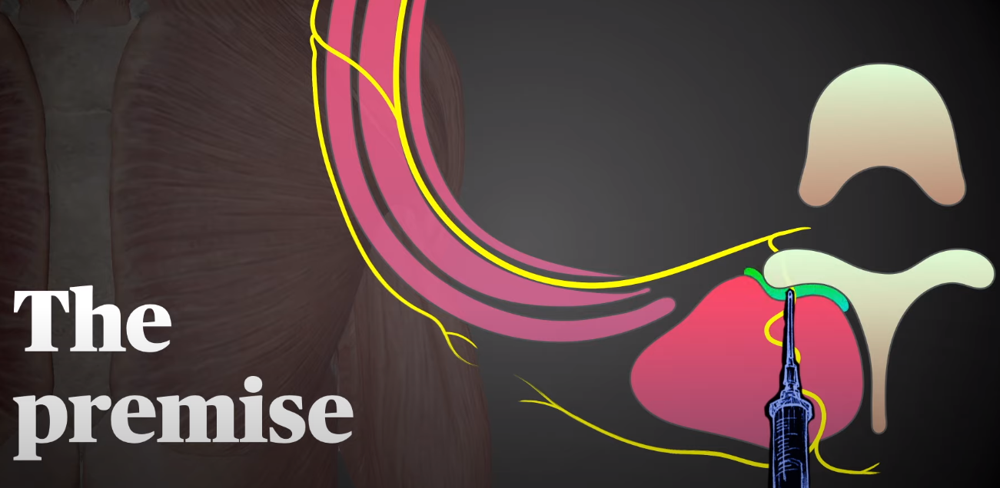
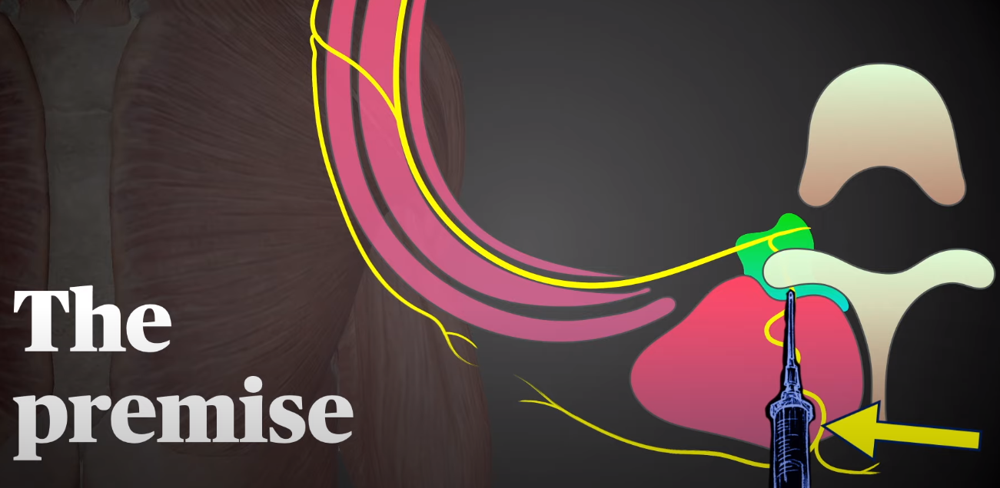

channel:: [[Youtube-channel/Regional Anesthesiology and Acute Pain Medicine]] 
tags:: [[RA/trunk/dorsal/erector spinae plane block]]

- {{video https://www.youtube.com/watch?v=O9RB0K7f8pM}}
- 
	- inject local anesthetic between the transvesus process and the fascia of the erector spinae muscle
	- it's a [[paravertebral block]] by proxy
		- 
- 30 mL of LA spread blocks
	- 8 thoracic levels
	- 4 lumbar levels
- intermitent administration by cath
	- 20 mL q3h
- Indications
	- 
	- T5 for thoracic surgery
	- T10 for abdominal surgery
	- L3 for lumbar surgery
- images of the ribs on US
	- rounder profile
	- pleura visible
	- sliding medially there's a shift to the transversus process
		- more squared apperance
		- more superficial
- needle oriented to touch the corner of the TP
	- hydrodissection
	-