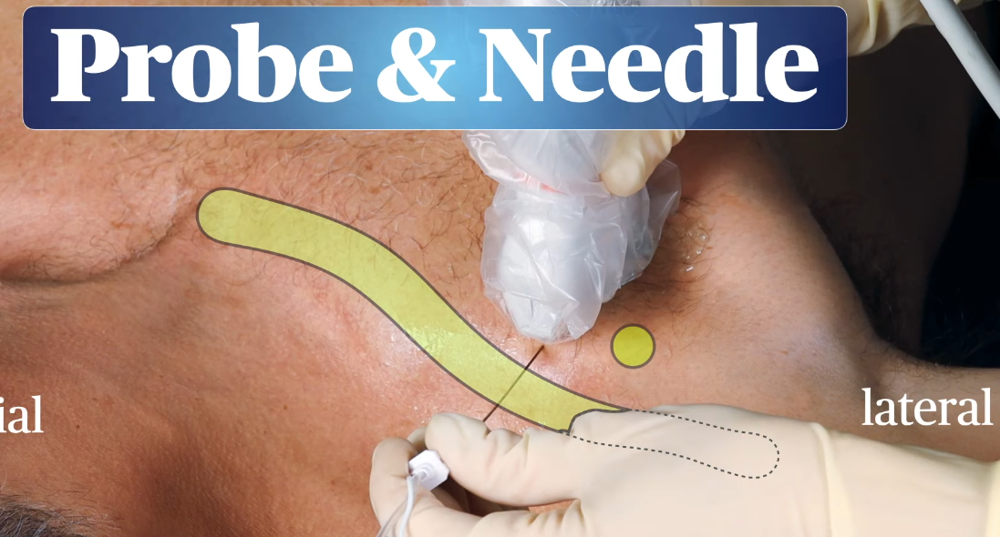
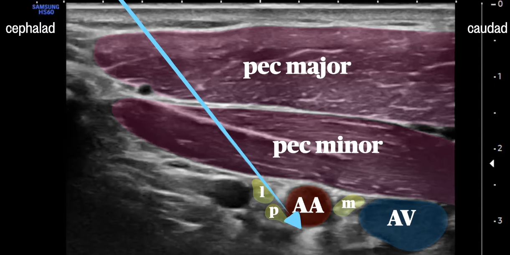
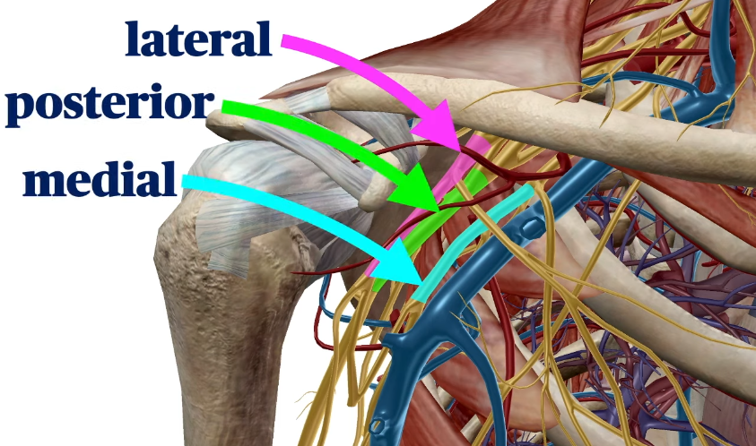
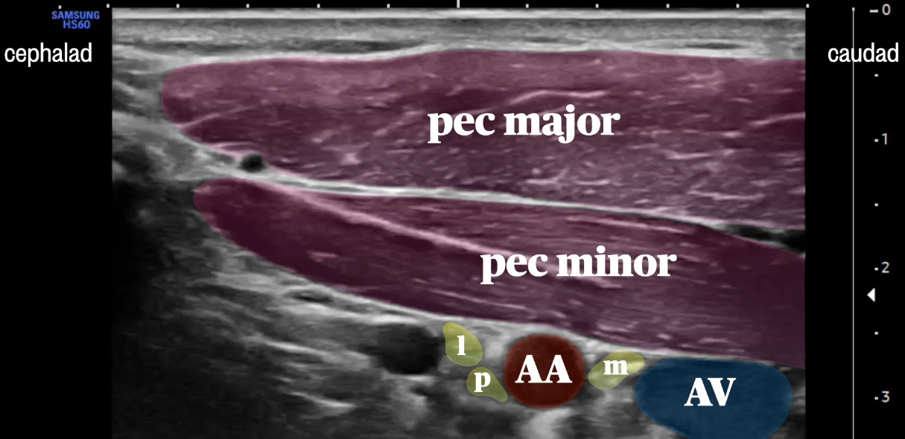
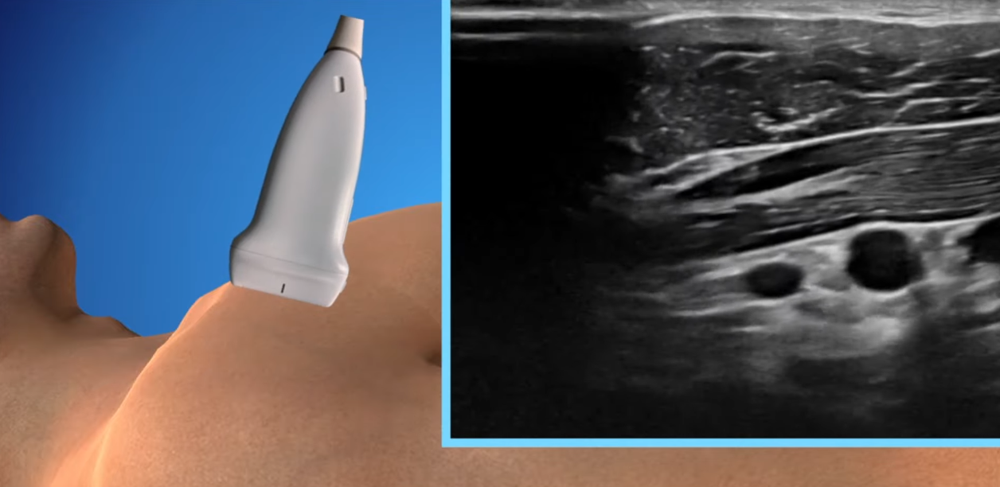

channel:: [[Youtube-channel/Regional Anesthesiology and Acute Pain Medicine]] 
tags:: [[surgery/upper-limb]]

- {{video https://youtu.be/Uk-2pdFQ75A?si=Hlg8_CBaflQHeLDI}}
- It's a #perivascular-technique
- approach from lateral or from above
	- 
- #[[ technique]]
	- needle tip deep to the artery first
	- 
	- 20-30 mL of LA
		- usually a single injection a the 6 o'clock location is enough
- # surface anatomy
	- distal to the [[bone/clavicle]]
	- medial to [[bone/scapula/coracoid-process]]
- # ultrasound anatomy
	- 3 chords of the brachial plexus
		- around the [[artery/axillary]]
		- 
	- 
	- deep to the [[muscle/pectoral-major]] and [[muscle/pectoral-minor]]
	- the [[vein/axillary]] is caudad to the artery
- # tips
	- since it's a steep and deep approach
		- the needle is difficult to visualize
		- use a heel-toe maneuver
			- 
		- or a curvilinear probe
	-
-