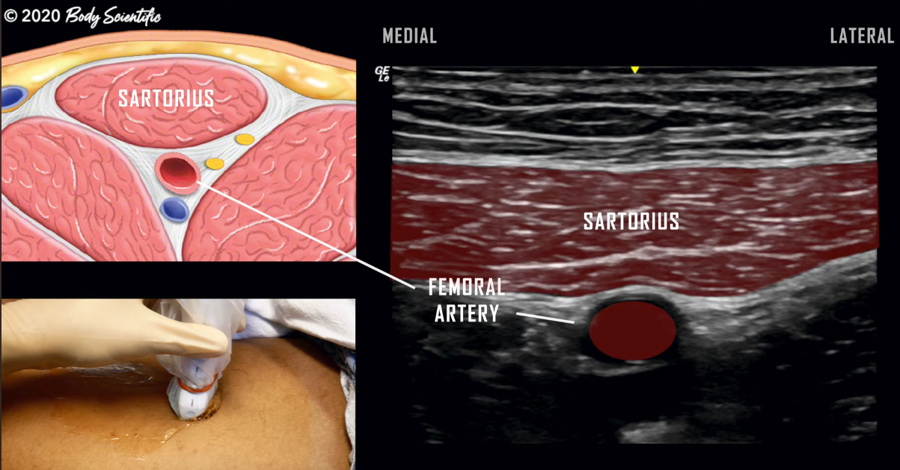
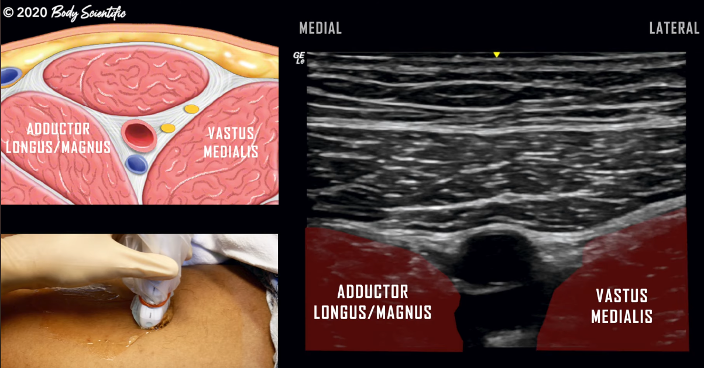
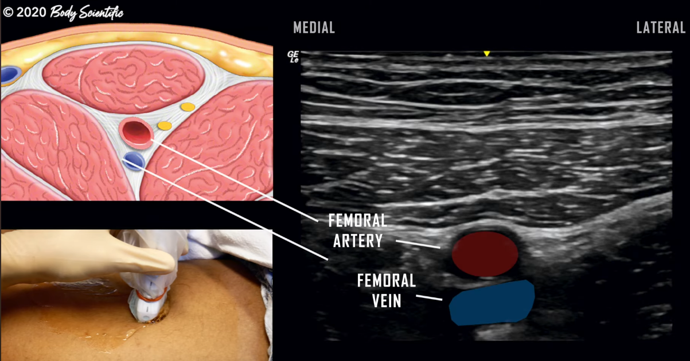
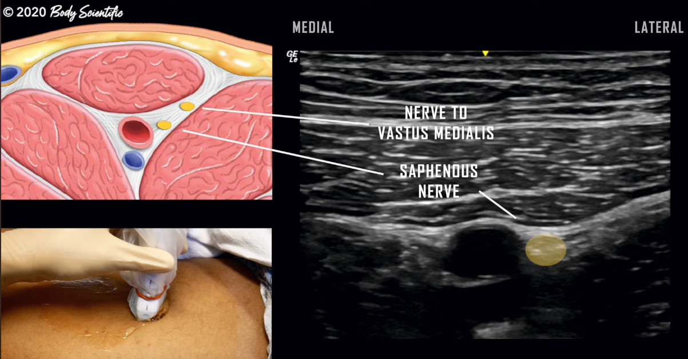

alias:: adductor canal block

- {{video https://youtu.be/_lp1rKuqzsk?si=vqkMw-EKeFM8QY3G}}
- transducer oriented transversally
- anterior-medial mid-thigh
- junction of middle and distal third of the thigh
- # ultrasound anatomy
	- #muscle/lower-limb/sartorius
	  collapsed:: true
		- 
	- #muscle/lower-limb/vastus-medialis
	- #muscle/lower-limb/adductor/longus
	  collapsed:: true
		- 
	- #artery/femoral
	- #vein/femoral
		- 
	- 
	- the nerve is lateral to the artery